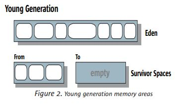
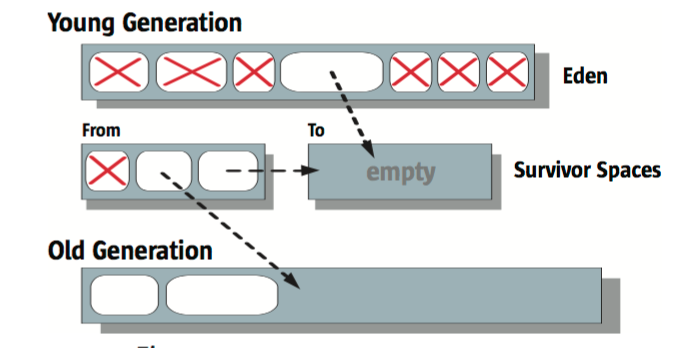
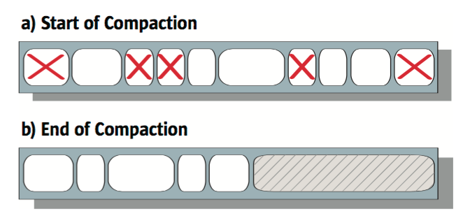

# [Memory Management in HotSpot VM](http://www.oracle.com/technetwork/java/javase/memorymanagement-whitepaper-150215.pdf)

##  Explicit vs Automatic Memory Management
Problems of Explicit Memory Management
* Dangling reference
* Memory leak

## Garbage Collect Concepts
Responsibility of GC:
* allocating memory
* ensuring that any referenced objects remain in momory
* recovering memory userd by objects that are no longer reachable from references in executing code

### Desired Garbage Collector Characeristics
Safe
* Live data must never be erroneously freed

Comprehensive
* Garbage should not remain unclaimed for more than a small number of collection cycles.

Limitation of fragmentation
* Compaction is to eliminate fragmentation

Scalability
* Allocation should not become a scalability bottleneck for multithread application on multiprocessor systems
* Collection should not be such a bottleneck

### Design Choices

Choices for designing a GC algorithm

* Serial vs Parallel
* Concurrent vs Stop-the-world
* Compacting vs Non-compacting vs Copying

#### Serial vs Parallel

Serial

* Only one thing happens at a time.

Parallel

* Tasks split into parts, executed on different CPUS
* Additional complexity and potential fragmentation

#### Concurrent vs Stop-the-world

Concurrent

* Application can execute concurrently
* do its work concurrently
* occasionally `stop-the-world`

Stop-the-world

* simpler
* the application is completely suspended

#### Compacting vs Non-compacting vs Copying

Compacting

* no fragmentation
* easy and fast to allocate a new object

Non-compacting

* faster to complete GC
* more fragmentation

Copying
* source are can be considered empty and available for fast and easy subsequent allocations
* additional time required for copying the extra space

### Performance Metrics

Throughput
* the percentage of total time not spent in GC

Garbage collection overhead
* the inverse of `throughtput`, i.e. the percentage of the total time spent in GC.

Pause time
* the length of time during which application execution is stopped while GC.

Frequency of collection
* how often the collection occurs
Footprint
* a measure of size, such as heap size
Promptness
* the time between an object becomes garbage and when the memory becomes available

### Generation Collection
* Different algorithms can be used in different generations.
* The algorithm for young generation typically puts a premium on speed.
* Old generation considers spaces efficient.

## Garbage collectors in Hotspot JVM
### Hotspot generations
Young generation
* Eden * 1
* survivor spaces * 2 
Old generation

Permanent generation
* holds objects that JVM finds convenient to have the garbage collector manage, such as objects describing classes and methods, as well as the classes and methods themselves.

### Garbage Collection type
* Minor GC
* Major GC

Young generation uses its own algorithm. Old generation and permenant generation use the algorithm of old generation.

Old generation is too full to accept all the objects from young generation.
* Young generation algorithm will not be run, but the old generation algorithm will be run except CMS collector.
* Old generation altorithm is special, and it cannot collect young generation.

### Fast Allocation

Allocate memory from large memory lot is efficient, `bump-the-pointer` technique will be used.

Allocation operatoin should be thread-safe for multi-thread application.

Thread local alllcation buffer(TLAB)
* Give thread its own buffer.
* TLAB is filled, then the thread needs to get a new one. And this should be synchronized.

### Serial Collector
Both yound and old generation are collected with the `stop-the-world` type.  
Application halt while the GC happens.
#### Yound generation GC

#### Old generation GC

* Mark-sweep-compact
* Sliding compaction
* Thread-safe bump-the-pointer

#### When to use serial GC
* Client-style machines
* Do not have a requirement about low pause times.

### Pallel Collector
