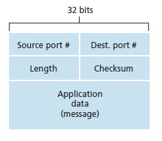
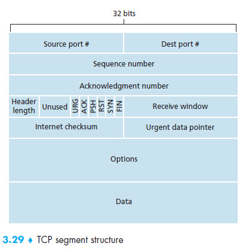

## Introduction and Transport-Layer Service

### UDP(User Datagram Protocol)  
Provide an unreliable, connectionless service.  

### TCP(Transmission Control Protocol)
Provide a reliable, connection-oriented service to the invoking application.  

IP service model is a best-effort delivery service.

## Multiplexing and demultiplexing

### Feature of UDP

- Finner application-level control over what data is sent and when.  
- No connection establishment.
- No connection state.
- Small packet header overhead.

## Principle of Reliable Data Transfer

### ARP (Automatic Repeat reQuest)

- Error detection
- Receiver feedback
- Retransmission

### Mechanism and Usage

#### Checksum

- Used to detect bit error in a transmitted packed.

#### Timer
- Used to timeout/retransmit a packet, possibly because the packet(or its ACK) was lost within the channel. Because timeout can occur when a packet is delayed but not lost(premature timeout), or when a packet has been received by the receiver byt the reveiver-to-sender ACK has been lost, duplicate copies of a packet may be receivered by a receiver.

#### Sequence number
- Used for sequential numbering of packets of data flowing from sender to receiver. Gaps in the sequence numbers of received packets allow the receiver to detect a packet lost. Packet with duplicate sequence numbers allow the receiver to detect duplicate copies of a packet.

#### Ackowledgement
- Used by the receiver to tell the sender that a packet or set of packets has been received correctly. Ackowledgements will typically carry the sequence number of the packet or packets being ackowledged. Ackowledgements may be individual or cumulative, depending on the protocol.

#### Negative Ackowledgement
- Used by the receiver to tell the sender that a packet has not been received correctly. Negative ackowledgements will typically carry the sequence number of the packet that was not received correctly.

#### Window, pipelining
- The sender may be restricted to sending only packets with sequence number that fall within a given range. By allowing multiple packets to be transmitted by not yet ackowledged, sender utilization can be increated over a stop and wait mode of operation. We will see shortly that the window size may be set on the basis of the receiver's ability to receive and buffer messages, or the level of congestion in the network or both.

## TCP

